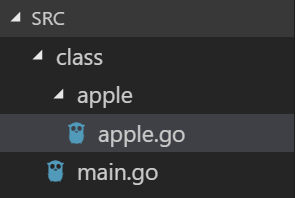

# 本地編譯與安裝第三方套件

## \#編譯

我們先打開`GOPATH` 所在路徑下的src資料夾，然後在裡面建立一個目錄名為class

然後在class目錄下創建一個apple目錄，之後裡面放面apple.go 外面放入main.go 如下圖所示



### 1.我們在apple.go新增如下程式 \(package name會和其父資料夾名稱相同\)

```go
package apple

import "fmt"

func Add(x int, c int) string {
    return fmt.Sprintf("%s%d%s", "There are: ", x+c, " apples\n")
}
```

> 這裡Sprintf會後面講到，此Add函數功能為把參數x和c相加後結合字串return出去

### 2.然後我們在class路徑的terminal下輸入

```text
go install
```

之後看到上層pkg目錄下會多出一個class資料夾 然後裡面有一個apple.a的檔案

### 3.接著我們在class目錄下新增main.go

```go
package main

import (
   apple "class/apple"
   "fmt"
)

func main() {
   fmt.Printf(apple.Add(1, 2))
}
```

之後輸入`go run main.go`

即可看到成功印出訊息

### 4.接著把$GOPATH/bin/ 加入PATH

然後我們在terminal任何路徑輸入`class`

之後會印出訊息

> 我們在class路徑下執行go install 時除了會在pkg產生.a檔案 也會在bin文件夾產生class可執行文件

### 5.在class目錄下執行go build

會在class目錄產生一個`class.exe`

之可執行文件

## 安裝第三方套件

```text
go get
```

> get 後如加上 -u 則可以更新包
>
> [https://golang.org/pkg/cmd/go/internal/get/](https://golang.org/pkg/cmd/go/internal/get/)

我們試著輸入

```text
go get -u github.com/kataras/iris
```

之後要稍等一下

然後查看 pkg目錄/平台/ 裡面會多出一個 github.com 資料夾，點進去會有kataras資料夾，裡面存放iris這個第三方套件

> go get 可以視為把repo 先clone到src資料夾後執行go install

