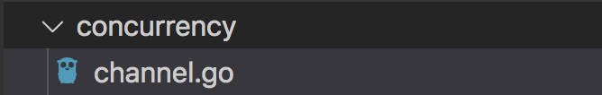

# export 與 import

使用以下方法即可 import 另一個資料夾的 func，與go mod 不同的是 import時需要多寫上路徑。

1. 新增一個資料夾與一個要export的檔案



```go
package concurrency

import (
	"fmt"
)

func Say(s string) {
	fmt.Print(s)
}
```

> 記得export 的 function 第一個字要大寫

2.  新增 要 import的檔案

hello.go

```go
package main;

import (
	concurrency "./concurrency"
)

func main() {
	concurrency.Say("hello");
}
```


之後即可。

##  使用 go mod 的話 import 只要放入 go mod 名稱在前面即可

```text
go mod init test-backend
```

例如在 route 檔案可使用如下：

```text
package routes

import (
	controllers "test-backend/controllers"
)

func CatchphrasesRoute(route fiber.Router) {
	route.Get("/", controllers.GetAllCatchphrases)
}
```

