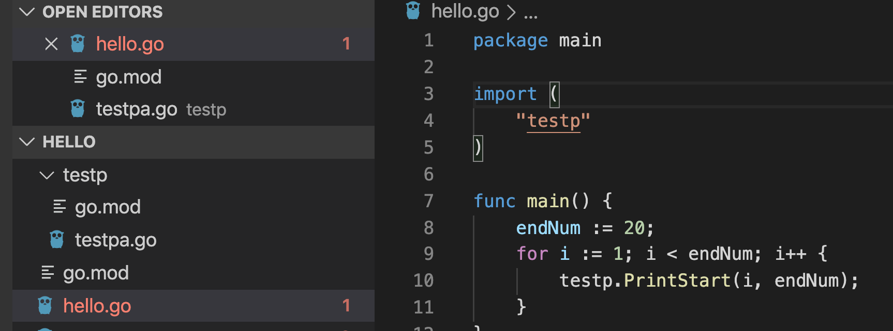

# 使用 go mod

如果是在同一個資料夾引入的話可以單純把他一起編譯進去即可

```
go run ./hello.go ./utils.go
```

## 如果是在不同資料夾則會有package 的概念

1.以前必須要寫在GOPATH下面，但現在有go mod，可以直接用`go mod init <package name>`

2\. package name要跟資料夾名稱相同，裡面檔案名稱沒差

3.要被引用的func 第一個字母都要大寫

4.我們先新增一個資料夾叫testp，然後裡面放入一個檔案.go 之後在那個資料夾輸入 `go mod init testp`

testp.go

```go
package testp

import "fmt"

func PrintStart(count int, endNum int) {
	for i := 0; i < endNum-count; endNum-- {
		fmt.Print(" ")
	}
	for i := 0; i < count*2; i++ {
		fmt.Print("*")
	}
	fmt.Print("\r\n")
}

```

5.然後在main package 也輸入 `go mod init main`

記得要在main 的 go.mod新增`replace testp => ./testp` 否則會出現 error

```
build command-line-arguments: cannot load testp: malformed module path "testp": missing dot in first path element
```

6\. main.go

```go
package main

import (
	"testp"
)

func main() {
	endNum := 20;
	for i := 1; i < endNum; i++ {
		testp.PrintStart(i, endNum);
	}
}
```

即可







## 注意事項：

1.記得 go mod init 時 main.go 放在專案資料夾根目錄

2\. init 名稱跟資料夾名稱相同
