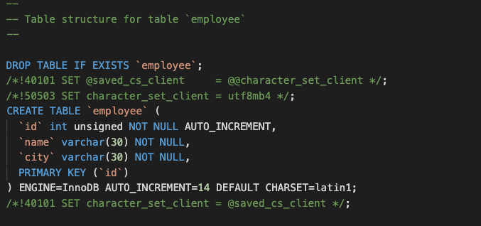

# MySQL

### 查詢單筆

```go
package main

import (
	"database/sql"
	"fmt"

	_ "github.com/go-sql-driver/mysql"
)

func main() {
	db, err := sql.Open("mysql", "root:example@/USERS")
	if err != nil {
		panic(err.Error())
	}
	defer db.Close()
	
	rows, err := db.Query("SELECT name FROM user")
	if err != nil {
		panic(err.Error()) // proper error handling instead of panic in your app
	}
	var name string
	err = rows.Scan(&name)
	fmt.Println(name)
}
```

> 宣告一個變數，之後傳變數的地址給 `rows.Scan`

## 查詢多筆

```go
package main

import (
	"database/sql"
	"fmt"

	_ "github.com/go-sql-driver/mysql"
)

func main() {

	db, err := sql.Open("mysql", "root:example@/USERS")
	if err != nil {
		panic(err.Error())
	}
	defer db.Close()

	rows, err := db.Query("SELECT * FROM user")
	if err != nil {
		panic(err.Error()) // proper error handling instead of panic in your app
	}
	columns, err := rows.Columns()
	if err != nil {
		panic(err.Error()) // proper error handling instead of panic in your app
	}

	// Make a slice for the values
	values := make([]sql.RawBytes, len(columns))

	// rows.Scan wants '[]interface{}' as an argument, so we must copy the
	// references into such a slice
	// See http://code.google.com/p/go-wiki/wiki/InterfaceSlice for details
	scanArgs := make([]interface{}, len(values))
	for i := range values {
		scanArgs[i] = &values[i]
	}

	// Fetch rows
	for rows.Next() {
		// get RawBytes from data
		err = rows.Scan(scanArgs...)
		if err != nil {
			panic(err.Error()) // proper error handling instead of panic in your app
		}

		// Now do something with the data.
		// Here we just print each column as a string.
		var value string
		for i, col := range values {
			// Here we can check if the value is nil (NULL value)
			if col == nil {
				value = "NULL"
			} else {
				value = string(col)
			}
			fmt.Println(columns[i], ": ", value)
		}
		fmt.Println("-----------------------------------")
	}
	if err = rows.Err(); err != nil {
		panic(err.Error()) // proper error handling instead of panic in your app
	}

}
```

## 確認資料是否存在

```go
func UserExists(db *sql.DB, account string) bool {
	sqlStmt := `SELECT account FROM user WHERE account = ?`
	err := db.QueryRow(sqlStmt, account).Scan(&account)
	if err != nil {
		if err != sql.ErrNoRows {
			log.Print(err)
		}
		return false
	}
	return true
}
```

## 插入資料

```go
package main

import (
	"database/sql"
	"fmt"
	"log"
	"net/http"

	_ "github.com/go-sql-driver/mysql"
)

func dbConn() (db *sql.DB) {
	dbDriver := "mysql"
	dbUser := "root"
	dbPass := "example"
	dbName := "USERS"
	db, err := sql.Open(dbDriver, dbUser+":"+dbPass+"@/"+dbName)
	if err != nil {
		panic(err.Error())
	}
	return db
}

func insert(w http.ResponseWriter, r *http.Request) {
	log.Println("onRequest")
	db := dbConn()
	if r.Method == "POST" {
		r.ParseForm()
		name := r.FormValue("name")
		city := r.FormValue("city")
		insForm, err := db.Prepare("INSERT INTO employee(name, city) VALUES(?,?)")
		if err != nil {
			panic(err.Error())
		}
		insForm.Exec(name, city)
		log.Println("INSERT: Name: " + name + " | City: " + city)
	}
	defer db.Close()
	http.Redirect(w, r, "/", 301)
}

func main() {
	log.Println("Server started on: http://localhost:8050")
	http.HandleFunc("/insert", insert)
	http.ListenAndServe(":8050", nil)
}
```

## 更新資料

```go
	app.Post("/updateUser", func(c *fiber.Ctx) {
		user := new(User)
		if err := c.BodyParser(user); err != nil {
			log.Fatal(err)
		}
		insForm, err := db.Prepare("UPDATE user SET name=?, city=? WHERE id=?")
		if err != nil {
			panic(err.Error())
		}
		fmt.Println(user)
		_, err = insForm.Exec(user.Name, user.City, user.ID)
		if err != nil {
			panic(err.Error())
		}
		c.JSON(fiber.Map{"status": "ok"})
	})
```

## 將 整個資料庫 產生 table SCHEMA

[https://dev.mysql.com/doc/refman/8.0/en/mysqldump.html](https://dev.mysql.com/doc/refman/8.0/en/mysqldump.html)

可使用 mysqldump，如果在 docker 內要使用如下指令。

```bash
docker exec <docker id> //usr/bin/mysqldump -u root --password=example --routines --triggers <DB名稱> > ~/test_db_backup.sql
```



[https://stackoverflow.com/a/899139/4622645](https://stackoverflow.com/a/899139/4622645)

## 可能錯誤

1.通常為 schema 與資料不同，或是給的長度不夠

> panic: runtime error: invalid memory address or nil pointer dereference \[signal SIGSEGV: segmentation violation code=0x1 addr=0x18 pc=0x143b97e\]


