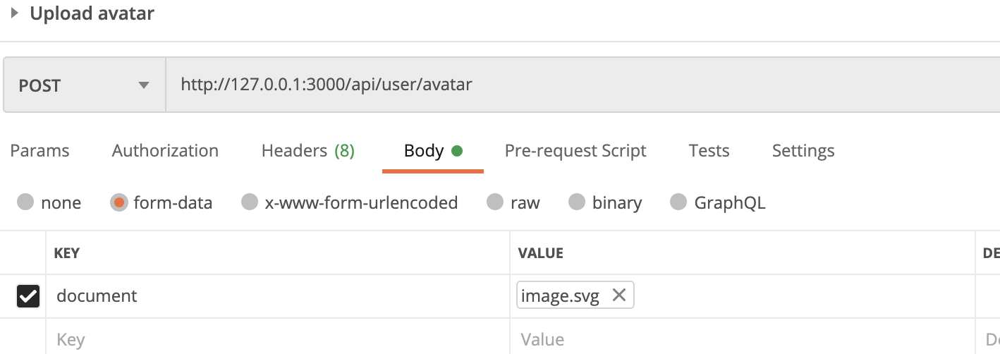

# Fiber 框架

類似於 Node.js express 寫法。



## 回傳 JSON

```go
package main

import "github.com/gofiber/fiber"

func main() {
	app := fiber.New()

	app.Get("/", func(c *fiber.Ctx) {
		c.JSON(fiber.Map{"code": 200, "message": "Hello, World"})
	})

	app.Listen(3000)
}
```

## parse body

```go
	app.Post("/signup", func(c *fiber.Ctx) {
		fmt.Println(c.Body())
	})
	
	// name=test&city=ewe
```

使用 body parser

```go
package main

import (
	"fmt"
	"log"

	"github.com/gofiber/fiber"
)

type User struct {
	Name string `json:"name"`
	City string `json:"city"`
}

func main() {
	app := fiber.New()
	app.Post("/signup", func(c *fiber.Ctx) {
		user := new(User)
		if err := c.BodyParser(user); err != nil {
			log.Fatal(err)
		}
		fmt.Println(user.Name)
	})
	app.Listen(3001)
}
```

> struct 跟裡面的 field 記得要大寫
>
> [https://stackoverflow.com/a/24837507/4622645](https://stackoverflow.com/a/24837507/4622645)

## 取得 header

使用 get

```go
app.Post("/signup", func(c *fiber.Ctx) { 
  ...
  fmt.Println(c.Get("authorization"))
```

## 加入 middleware

類似於 express 用法，傳入 next

```go
	app.Post("/message", func(c *fiber.Ctx) {
	 ....do something
		c.Next()
	}, func(c *fiber.Ctx) {
	 ....do something after
	}
```

或是

```go
func Auth(c *fiber.Ctx) {
  ...
  c.Next()
}

app.Post("/message", Auth, func(c *fiber.Ctx) {
 ...
}
```

## 取得 \*http.Request



使用 context\(\) 方法即可取得

```go
app.Post("/message", func(c *fiber.Ctx) {
 ...
 c.Context()
}
```

## 取得 path params

```go
app.Get("/:name", func(c *fiber.Ctx) error {
    msg := fmt.Sprintf("Hello, %s 👋!", c.Params("name"))
    return c.SendString(msg)
})
```

## 取得 query string

```go
app.Get("/", func(c *fiber.Ctx) error {
  c.Query("order")         // "desc"
  c.Query("brand")         // "nike"
  c.Query("empty", "nike") // "nike"
})
```

## Form-data 檔案上傳



```go
func UploadAvatar(c *fiber.Ctx) error {
	file, err := c.FormFile("document")

	// Save file to root directory:
	return c.SaveFile(file, fmt.Sprintf("./%s", file.Filename))
}
```

## Swagger 文件整合



[https://ithelp.ithome.com.tw/articles/10224472](https://ithelp.ithome.com.tw/articles/10224472)

