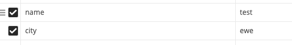
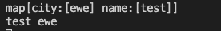

# http

## GET request

```go
package main

import (
    "fmt"
    "io/ioutil"
    "net/http"
    "os"
)

func main() {
    response, err := http.Get("http://golang.org/")
    if err != nil {
        fmt.Printf("%s", err)
        os.Exit(1)
    } else {
        defer response.Body.Close()
        contents, err := ioutil.ReadAll(response.Body)
        if err != nil {
            fmt.Printf("%s", err)
            os.Exit(1)
        }
        fmt.Printf("%s\n", string(contents))
    }
}
```

## HTTP Server

```go
// Writing a basic HTTP server is easy using the
// `net/http` package.
package main

import (
    "fmt"
    "net/http"
)

func hello(w http.ResponseWriter, req *http.Request) {
    fmt.Fprintf(w, "hello\n")
}

func main() {
    http.HandleFunc("/hello", hello)
    http.ListenAndServe(":8090", nil)
}
```

> golang server 重複用到 port 不會提示 error 就算是使用
>
> `log.Fatal(http.ListenAndServe(":8010", nil))`

### ResponseWriter 的寫入的三種方法

```go
w.Write([]byte("OK"))
fmt.Fprintf(w, "OK")
io.WriteString(w, "OK")
```

## 回傳 JSON 的 server

```go
	type User struct { 
     Name  string  `json:"name"` 
}
			
			user := User{Name: "jason"};
			data, err := json.Marshal(user)
			if err != nil {
				log.Fatal(err)
			}
			w.Header().Set("Content-Type", "application/json")
			w.Write(data);
```

## 回傳其他格式

```go
fmt.Fprintf(w, "%d", 123)
```

## 讀取 application/x-www-form-urlencoded

```go
package main

import (
	"fmt"
	"log"
	"net/http"
)

func main() {
	log.Println("Server started on: http://localhost:8050")
	http.HandleFunc("/", func(w http.ResponseWriter, r *http.Request) {
		r.ParseForm()
		name := r.FormValue("name")
		city := r.FormValue("city")
		fmt.Println(r.Form)
		fmt.Println(name, city)
	})
	http.ListenAndServe(":8050", nil)
}
```

> POST 必須帶三個必備 Header


body



回傳



## 解析 form/data

```go
package main

import (
	"fmt"
	"log"
	"net/http"
)

func main() {
	log.Println("Server started on: http://localhost:8050")
	http.HandleFunc("/", func(w http.ResponseWriter, r *http.Request) {
		r.ParseMultipartForm(0)
		// 後面的參數代表解析緩存 size
		name := r.FormValue("name")
		city := r.FormValue("city")
		fmt.Println(r.Form)
		fmt.Println(name, city)
	})
	http.ListenAndServe(":8050", nil)
}
```

