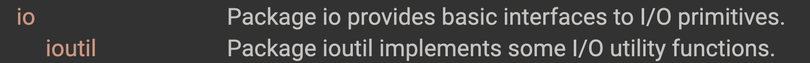

# IO

包含 io 與  ioutil



## 範例

讀取檔案轉 JSON

```go
package main
import (
	"os"
  "io/ioutil"
	"encoding/json"
)

func main() {
	jsonFile, err := os.Open("conf.json")
	
	if err != nil {
 	 fmt.Println(err)
	}

	defer jsonFile.Close()

	jsonStr, err := ioutil.ReadAll(jsonFile)
  if err != nil {
      log.Fatal(err)
  }
  doc := make(map[string]interface{})
  if err := json.Unmarshal(jsonStr, &doc); err != nil {
      log.Fatal(err)
  }
  fmt.Println(doc)
  fmt.Println(doc["AWS_ID"])
  fmt.Println(doc["AWS_KEY"])
  for k, v := range doc {
  	fmt.Println("%s:%s",k, v.(string))
  }
}

// map[AWS_ID:x12345123r2r4adefds AWS_KEY:test123]

// x12345123r2r4adefds
// test123
```

## IO Reader

定義如下

```go
type Reader interface {
    Read(p []byte) (n int, err error)
}
```

當讀取完後會出現 io.EOF

```go
// ErrShortWrite means that a write accepted fewer bytes than requested
// but failed to return an explicit error.
var ErrShortWrite = errors.New("short write")

// ErrShortBuffer means that a read required a longer buffer than was provided.
var ErrShortBuffer = errors.New("short buffer")

// EOF is the error returned by Read when no more input is available.
// Functions should return EOF only to signal a graceful end of input.
// If the EOF occurs unexpectedly in a structured data stream,
// the appropriate error is either ErrUnexpectedEOF or some other error
// giving more detail.
var EOF = errors.New("EOF")

// ErrUnexpectedEOF means that EOF was encountered in the
// middle of reading a fixed-size block or data structure.
var ErrUnexpectedEOF = errors.New("unexpected EOF")

// ErrNoProgress is returned by some clients of an io.Reader when
// many calls to Read have failed to return any data or error,
// usually the sign of a broken io.Reader implementation.
var ErrNoProgress = errors.New("multiple Read calls return no data or error")
```

許多模組包含 strings 都有接入此 Read 接口

## IO Write

通常會用 for loop 來讀取與寫入，或是可用 io.copy來替代。相較於先使用 readAll 然後 fPrintf 的方式，會導致記憶體洩漏，可用 io.copy 解決。

不錯的文章可參考：

{% embed url="https://blog.kennycoder.io/2020/02/08/Golang-%E8%AA%8D%E8%AD%98-io-package%E7%9A%84%E5%8E%9F%E7%90%86%E8%88%87%E6%93%8D%E4%BD%9C/" %}

## 對檔案的文字行進行操作

如果要進行文字細部操作可使用 bufio 模組。

[https://openhome.cc/Gossip/Go/bufio.html](https://openhome.cc/Gossip/Go/bufio.html)

