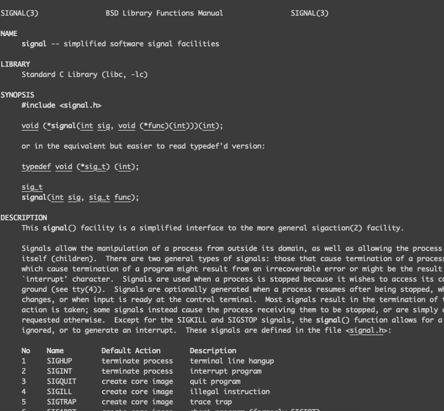

# Signal

主動發送 system call 相關信號

```go
package main

import (
	"fmt"
	"os"
	"syscall"
)

func raise(sig os.Signal) error {
	p, err := os.FindProcess(os.Getpid())
	if err != nil {
		return err
	}
	fmt.Println(sig)
	return p.Signal(sig)
}

func main() {
	raise(syscall.SIGQUIT)
}
```

可以輸入 `man signal` 查看可用信號



